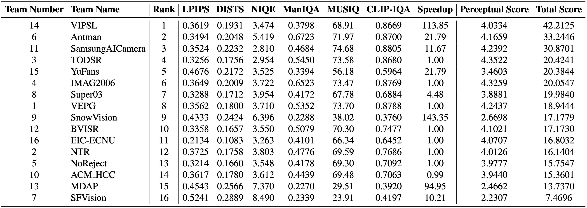

# [NTIRE 2026 Challenge on Mobile Real-World Image Super-Resolution](https://cvlai.net/ntire/2026/) @ [CVPR 2026](https://cvpr.thecvf.com/)

[](https://www.cvlai.net/ntire/2026/)
[](https://gobunu.github.io/ntire_mobile_sr)
[](https://arxiv.org/abs/2604.17306)
[](https://github.com/jiatongli2024/NTIRE2026_Mobile_RealWorld_ImageSR)
[](https://github.com/jiatongli2024/NTIRE2026_Mobile_RealWorld_ImageSR)
[](https://github.com/jiatongli2024/NTIRE2026_Mobile_RealWorld_ImageSR/releases/tag/v1)

## About the Challenge

The challenge is part of the 11th NTIRE Workshop at CVPR 2026, which targets the real-world image super-resolution on mobile devices. Participants should recover a high‑resolution image from a single low‑resolution input that is 4 × smaller and with unknown degradations.

The evaluation consists of comparing the restored high-resolution images with the ground truth high-resolution images. To comprehensively assess the results, we employ evaluation metrics as follows:  

- **Inference Speed:** We will benchmark the inference speed on the **MediaTek Dimensity 8400** platform, using the inference speed of **OSEDiff** on this platform as the baseline. The input image size is $128\times 128$, and the ouput size is $512\times 512$. We define $t_{osediff}$ and $t_{curmodel}$ as the average inference time on single image using OSEDiff and current model, and the definition of speedup ratio is:

$$
Speedup=\frac{t_{osediff}}{t_{curmodel}}
$$


- **Perceptual Metrics:** **LPIPS**, **DISTS**, **NIQE**, **ManIQA**, **MUSIQ**, and **CLIP-IQA**. To measure the super-resolution performance, we calculate the average weighted value of the six perceptual metrics. The input image size is arbitrary. The Score is defined as follows:

$$
\text{Score} = \left(1 - \text{LPIPS}\right) + \left(1 - \text{DISTS}\right) + \text{CLIPIQA} + \text{MANIQA} + \frac{\text{MUSIQ}}{100} + \max\left(0, \frac{10 - \text{NIQE}}{10}\right)
$$

The final score of each participant is defined as follows:

$$
FinalScore=2^{Score}\cdot {Speedup}^{0.2}
$$

## Challenge results

- **16 valid submissions** are ranked.
- **Evaluation set:** all scores are measured on the **DIV2K‑val (100 images)** with unknown degradations.
- **Overall order**: ranking depends on the $FinalScore$.


## Certificates
The top three teams in this competition have been awarded NTIRE 2026 award certificates. 

All certificates can be downloaded from [Google Drive](https://drive.google.com/file/d/1exduTHhqQqvVXm-J6ae-QPqRBwIAiImv/view?usp=sharing).


## How to test the model?

1. `git clone https://github.com/jiatongli2024/NTIRE2026_Mobile_RealWorld_ImageSR.git`
2. Download the model weights from:

    - [Google Drive](https://drive.google.com/drive/folders/1WvVqMqS8XxAsBRaYpPgHYTYe62agsP01?usp=sharing)

    Put the downloaded weights in the `./model_zoo` folder.
3. Select the model you would like to test:
    ```bash
    CUDA_VISIBLE_DEVICES=0 python test.py --valid_dir [path to val data dir] --test_dir [path to test data dir] --save_dir [path to your save dir] --model_id 0
    ```
    - You can use either `--valid_dir`, or `--test_dir`, or both of them. Be sure the change the directories `--valid_dir`/`--test_dir` and `--save_dir`.
    - We provide a baseline (team00): DAT (default). Switch models (default is DAT) through commenting the code in [test.py](./test.py#L19).
4. Some methods cannot be integrated into our codebase. We provide their instructions in the corresponding folder. If you still fail to test the model, please contact the team leaders. Their contact information is as follows:
   | Index | Team | Leader | Email |
   | :---: | :--- | :--- | :--- |
   | 1 | VIPSL | JiaHao Deng | 1695185764djh@gmail.com |
   | 2 | Antman | Zhenzhong Chen | zzchen@whu.edu.cn |
   | 3 | SamsungAICamera | Yoonjin Im | yoonjin.im@samsung.com |
   | 4 | TODSR | Zihao Wang | wwzzhh@njust.edu.cn |
   | 5 | YuFans | Wei Zhou | weichow@u.nus.edu |
   | 6 | IMAG2006 | Xinzhe Zhu | xzzhu@njust.edu.cn |
   | 7 | Super03 | Runze Tian | Trz220765@mail.ustc.edu.cn |
   | 8 | VEPG | Congyu Wang | congyuwang@njust.edu.cn |
   | 9 | SnowVision | Choulhyouc Lee | iron.lee@snowcorp.com |
   | 10 | BVISR | Yuxuan Jiang | dd22654@bristol.ac.uk |
   | 11 | EIC-ECNU | Shaohui Lin | shlin@cs.ecnu.edu.cn |
   | 12 | NTR | Jiachen Tu | jtu9@illinois.edu |
   | 13 | NoReject | Yuqi Li | yuqili010602@gmail.com |
   | 14 | ACM_HCC | Shyang-En Weng | shyangenweng.cs13@nycu.edu.tw |
   | 15 | MDAP | Watchara Ruangsang | watchara.knot@gmail.com |
   | 16 | SFVision | Yuwen Pan | panyuwen@sz.tsinghua.edu.cn |


## How to eval images using IQA metrics?

### Environments

```sh
conda create -n NTIRE-SR python=3.8
conda activate NTIRE-SR
pip install -r requirements.txt
```


### Folder Structure

```
test_dir
├── HR
│   ├── 0901.png
│   ├── 0902.png
│   ├── ...
├── LQ
│   ├── 0901x4.png
│   ├── 0902x4.png
│   ├── ...
    
output_dir
├── 0901x4.png
├── 0902x4.png
├──...

```

### Command to calculate metrics

```sh
python eval.py \
--output_folder "/path/to/your/output_dir" \
--target_folder "/path/to/test_dir/HR" \
--metrics_save_path "./IQA_results" \
--gpu_ids 0 \
```

The `eval.py` file accepts the following 4 parameters:

- `output_folder`: Path where the restored images are saved.
- `target_folder`: Path to the HR images in the `test` dataset. This is used to calculate FR-IQA metrics.
- `metrics_save_path`: Directory where the evaluation metrics will be saved.
- `device`: Computation devices. For multi-GPU setups, use the format `0,1,2,3`.

## License and Acknowledgement
This code repository is release under [MIT License](LICENSE). 
